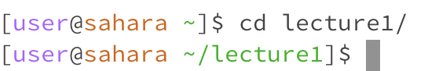
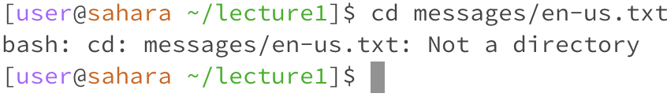
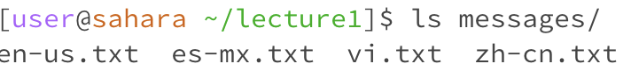
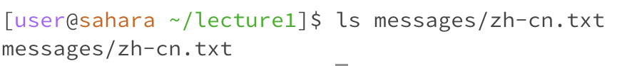
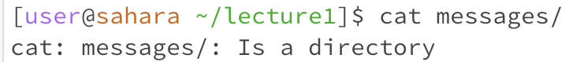
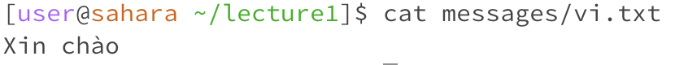

# Lab 1 Report 

## cd commands
**Without arguments**

Working directory: User's home directory

Nothing happened, since nothing was given as input so there is no directory to change to. This was not an error.

**With directory argument**

Working directory: User's home directory

It changed to the directory specified, which in this case was lecture1/. This was not an error.

**With file argument**

Working directory: lecture1/

No directory changes happens and a message is printed. This is an error since cd is a command used to change to another directory, not a file.

## ls commands
**Without arguments**

Working directory: User's home directory

It prints the contents of the current directory, which at this point only contains lecture1/. This was not an error.

**With directory argument**

Working directory: lecture1/

It prints the contents of the directory specified, which in this case was the contents of the messages directory (which contains all the .txt files). This was not an error.

**With file argument**

Working directory: lecture1/

It prints only the file specified, since a file doesn't have other files within it to print like a directory does. This is not an error.

## cat commands
**Without arguments**

Working directory: User's home directory

Nothing happens yet as the terminal waits for further input to be given. This is not an error.

**With directory argument**

Working directory: lecture1/

Nothing happens and a message is printed. This is an error since a file name was expected but a directory was given instead. 

**With file argument**

Working directory: lecture1/

The contents of the file is printed. This is not an error.
