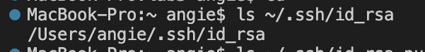

# Part 1

## StringServer Code

## First Time Using /add-message

### Which methods in your code are called?
The methods called in my code are StringServer's main method, as well as Handler's getList() and handleRequest() method. 
### What are the relevant arguments to those methods, and the values of any relevant fields of the class?
StringServer's main method is passed the arguments typed in the terminal (in this case, 4000 to specify the port). handleRequest was passed the url http://localhost:4000/add-message?s=hello. Port had a value of 4000. The String arrayList called string had the value of ["hello"]. String[] parameters had a value of ["s", "hello"]. str had a value of "1. hello \n".
### How do the values of any relevant fields of the class change from this specific request? If no values got changed, explain why.
The String arrayList called string changed from [] to ["hello"].
Other variables either remained unchanged or were initialized from this request.

## Second Time Using /add-message

### Which methods in your code are called?
The methods called in my code are StringServer's main method, as well as Handler's getList() and handleRequest() method. 
### What are the relevant arguments to those methods, and the values of any relevant fields of the class?
StringServer's main method is passed the arguments typed in the terminal (in this case, 4000 to specify the port). handleRequest was passed the url http://localhost:4000/add-message?s=goodbye. Port had a value of 4000. The String arrayList called string had the value of ["hello", "goodbye"]. String[] parameters had a value of ["s", "goodbye"]. str had a value of "1. hello \n 2. goodbye \n".
### How do the values of any relevant fields of the class change from this specific request? If no values got changed, explain why.
The String arrayList called string changed from ["hello"] to ["hello", "goodbye"].
Other variables either remained unchanged or were initialized from this request.

# Part 2
## Path to private key

## Path to public key

## Login to ieng6 without password

# Part 3
I learned about ssh keys this week, and how they can be used to remotely access other computers without the need to enter a password each time. The scp command was new to me, and I learned how it could be used to securely copy files between servers while following SSH protocol. 