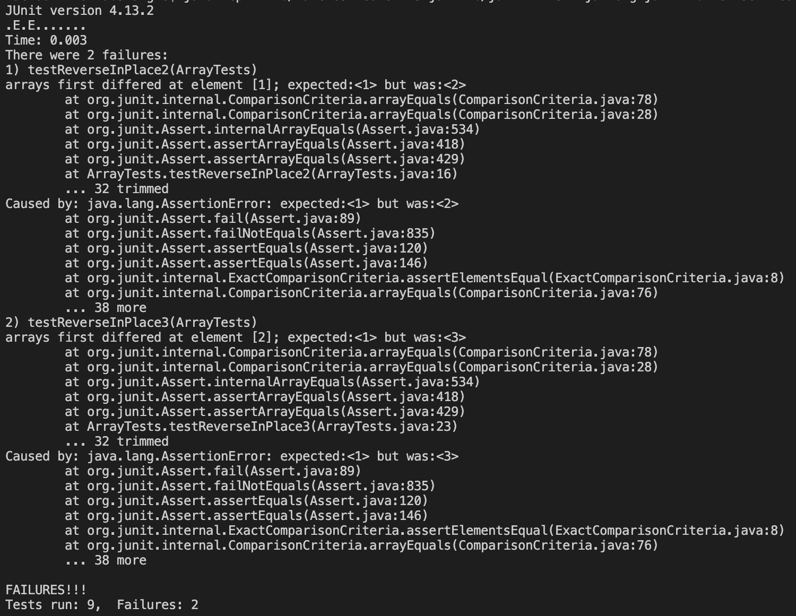

# Part 1 - Bugs

## Failure-inducing input
    @Test 
    public void testReverseInPlace2() {
        int[] input1 = { 1, 2 };
        ArrayExamples.reverseInPlace(input1);
        assertArrayEquals(new int[]{ 2, 1 }, input1);
    }

## Input without failure
    @Test 
    public void testReverseInPlace4() {
        int[] input1 = { 2, 2 };
        ArrayExamples.reverseInPlace(input1);
        assertArrayEquals(new int[]{ 2, 2 }, input1);
    }

## Symptom

## Bug

Before

    static void reverseInPlace(int[] arr) {
        for(int i = 0; i < arr.length; i += 1) {
            arr[i] = arr[arr.length - i - 1];
        }
     }

After

    static void reverseInPlace(int[] arr) {
        for(int i = 0; i < Math.floor(arr.length / 2); i += 1) {
            int temp = arr[i];
            arr[i] = arr[arr.length - i - 1];
            arr[arr.length - i - 1] = temp;
        }
    }

The first version of the code did not save the original values of the first half of the array somewhere, so it used incorrect values when updating the values of the second half of the array. This is addressed in the second version of the code, which goes through the first half of the array and swaps it with the corresponding element in the second half of the array. In this version, temp saves the original value of the element in the first half, so that the element in the second half of the array will be assigned the correct value. 

# Part 2 - Researching Commands
Chosen command: less

## Option #1: -E
Source: https://www.geeksforgeeks.org/less-command-linux-examples/ 

### Example 1

Command: 

    less -E  biomed/1471-213x-2-8.txt 
Output: 

    Background
    There is currently great interest in using extracellular
    signaling proteins to influence the gene expression program
    and differentiation of embryonic cells, in particular
    embryonic stem cells. Of the factors that contribute to
    specifying cell fate during development, Wnt proteins are
    among the most attractive candidates to use in such 
    in vitro experiments. Wnt proteins
    //Outputs rests of text file

This prints out all of the contents of biomed/1471-213x-2-8.txt as usual, except once the bottom is reached it automatically exits the process. This is useful in saving time, so we don't have to manually press q to quit once we're done reading through the file. 

### Example 2

Command: 

    less -E  plos/journal.pbio.0020001.txt 

Output:

    Kofi Annan, the Secretary-General of the United Nations, recently called attention to
    the clear inequalities in science between developing and developed countries and to the
    challenges of building bridges across these gaps that should bring the United Nations and
    the world scientific community closer to each other (Annan 2003). Mr. Annan stressed the
    importance of reducing the inequalities in science between developed and developing
    //Outputs rests of text file

This does the same and has the same usefulness as the first example, except it does so for the file plos/journal.pbio.0020001.txt 

## Option #2: -m
Source: https://www.qnx.com/developers/docs/6.4.0/neutrino/utilities/l/less.html

### Example 1
Command: 

    less -m  plos/journal.pbio.0020001.txt 

Output: 

    Kofi Annan, the Secretary-General of the United Nations, recently called attention to
    the clear inequalities in science between developing and developed countries and to the
    challenges of building bridges across these gaps that should bring the United Nations and
    //Outputs rest of file, shows '8%' at corner while viewing this portion.

This prints plos/journal.pbio.0020001.txt in the usual manner, except it also shows the percentage corresponding to our current placement in the file being shown. This is useful to gauge how much of the file still needs to be read and to judge whether a larger window is needed when printing it. 

### Example 2
Command: 

    less -m  biomed/1471-213x-2-8.txt 

Output:

    Background
    There is currently great interest in using extracellular
    signaling proteins to influence the gene expression program
    and differentiation of embryonic cells, in particular
    embryonic stem cells. Of the factors that contribute to
    specifying cell fate during development, Wnt proteins are
     //Outputs rest of file, shows '7%' at corner while viewing this portion.

This does the same and has the same usefulness as the first example, except it does so for the file biomed/1471-213x-2-8.txt

## Option #3: -N
Source: https://www.qnx.com/developers/docs/6.4.0/neutrino/utilities/l/less.html 

### Example 1
Command: 

    less -N  biomed/1471-213x-2-8.txt 

Output: 

    1 
    2   
    3     
    4       
    5         Background
    6         There is currently great interest in using extracellular
    7         signaling proteins to influence the gene expression program
    8         and differentiation of embryonic cells, in particular
    9         embryonic stem cells. Of the factors that contribute to
    10         specifying cell fate during development, Wnt proteins are
    11         among the most attractive candidates to use in such 
    12         in vitro experiments. Wnt proteins
    //Outputs rest of the file

This outputs the contents of biomed/1471-213x-2-8.txt as usual, except it includes the line number for each of the lines. This is useful when we need to know the location of a particular portion of the text, and makes it easier to refer back to later on. 

### Example 2
Command: 

    less -N  plos/journal.pbio.0020001.txt 

Output:

    1 
    2   
    3     
    4       
    5         
    6         Kofi Annan, the Secretary-General of the United Nations, recently called attention to
    7         the clear inequalities in science between developing and developed countries and to the
    8         challenges of building bridges across these gaps that should bring the United Nations and
    9         the world scientific community closer to each other (Annan 2003). Mr. Annan stressed the
    10         importance of reducing the inequalities in science between developed and developing
    11         countries, asserting that “This unbalanced distribution of scientific activity generates
    //Outputs rest of the file

This does the same and has the same usefulness as the first example, except it does so for the file plos/journal.pbio.0020001.txt 

## Option #4: -p
Source: https://www.qnx.com/developers/docs/6.4.0/neutrino/utilities/l/less.html

### Example 1
Command: 

    less -p Canada plos/journal.pbio.0020001.txt less -p Canada plos/journal.pbio.0020001.txt 

Output: 

    lion's share (84.2%), followed by Canada (10.35%). Latin America as a whole contributed
    only 5.45% to the total number of scientific publications in these ten years (RICYT
    2002).
    The total number of publications, however, is not necessarily the best measure for
    assessing scientific productivity or technical advances (May 1997). More relevant
    measurements for these factors include the proportional change in the number of
    publications and the total number of publications when corrected for investment in research
    and development (May 1997). The proportional change in the number of publications, using
    1990 as a comparison, revealed that scientific publishing in Latin America increased the
    most rapidly in the Americas, far outpacing the United States and Canada (Figure 1).
    //Outputs rest of file, highlights all "Canada" matches

This outputs the contents of plos/journal.pbio.0020001.txt, except it starts at the first line in which the pattern, "Canada", appears. It also highlights all matches to "Canada". This is useful when wanting to read a particular section of the file, allowing us to specify what word to look for and immediately jumping to that section. 

### Example 2
Command: 

    less -p Follistatin  biomed/1471-213x-2-8.txt 

Output:

    for MSX1, ID2, Follistatin, Versican and Cyclin D1 (not
    shown). In contrast, cycloheximide did not block
    induction of target genes by BMP (Figure 4), the
    mechanism of which does not involve protein accumulation
    [ 12 ] . These findings underscore the importance of
    β-catenin protein elevation in the response to Wnt. This

This does the same and has the same usefulness as the first example, except it does so for the file biomed/1471-213x-2-8.txt, starts at the first line for the match "Follistatin" and highlights all matches to "Follistatin". 