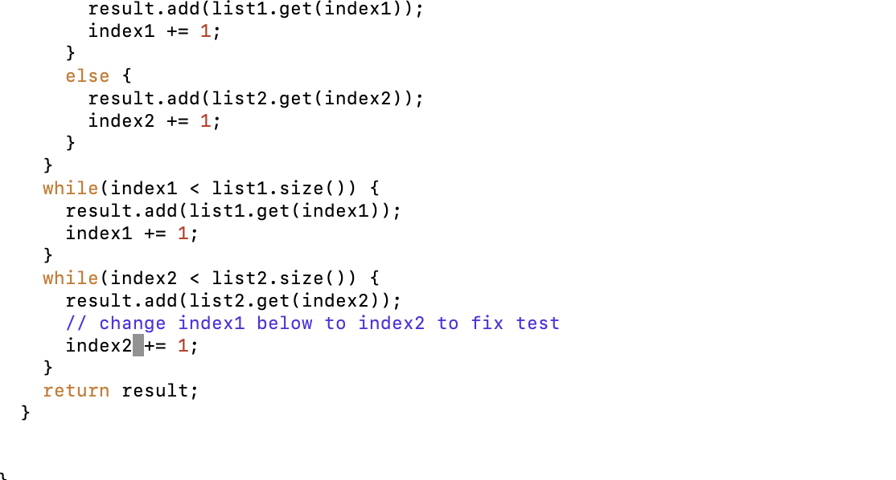

# Vim - Repeat of Timed Tasks

## Log into ieng6

    ssh cs15lfa23ma@ieng6.ucsd.edu

- Ran terminal command to connect to ieng6 using ssh key. 

## Clone your fork of the repository from your Github account (using the SSH URL)

    git clone git@github.com:Angie-n/lab7.git

- Ran terminal command to clone lab7 git repository using ssh key.

## Run the tests, demonstrating that they fail

    cd lab7/
    bash test.sh 

- Ran terminal command to move to lab7 folder so test.sh runs correctly.
- Then ran terminal command to run the test.sh script.

## Edit the code file ListExamples.java to fix the failing test 

    vim ListExamples.java
    //vim commands
    ?index1
    i
    <shift><right-arrow>
    <left-arrow>
    <delete>
    2
    <escape>
    :wq

- Ran terminal command to use vim to edit ListExamples.java
- Used reverse search to find last match of index1
- Used i to enter insert mode
- Used shift right-arrow to travel to start of next word
- Used left-arrow to move cursor to the space right after '1'
- Used delete to delete '1' from index1
- Entered '2' so the word is now index2
- Pressed escape to exit insert mode
- Entered :wq to exit vim and save changes

## Run the tests, demonstrating that they now succeed

    bash test.sh

- Ran terminal command to run the test.sh script

## Commit and push the resulting change to your Github account

    git add -A
    git commit -m "Changed index1 to index2 to address error in ListExamples.java"
    git push origin main

- Ran git command to stage all changes.
- Ran git command to commit changes with a message detailing the specific change
- Ran git command to push the changes to the forked git repository
