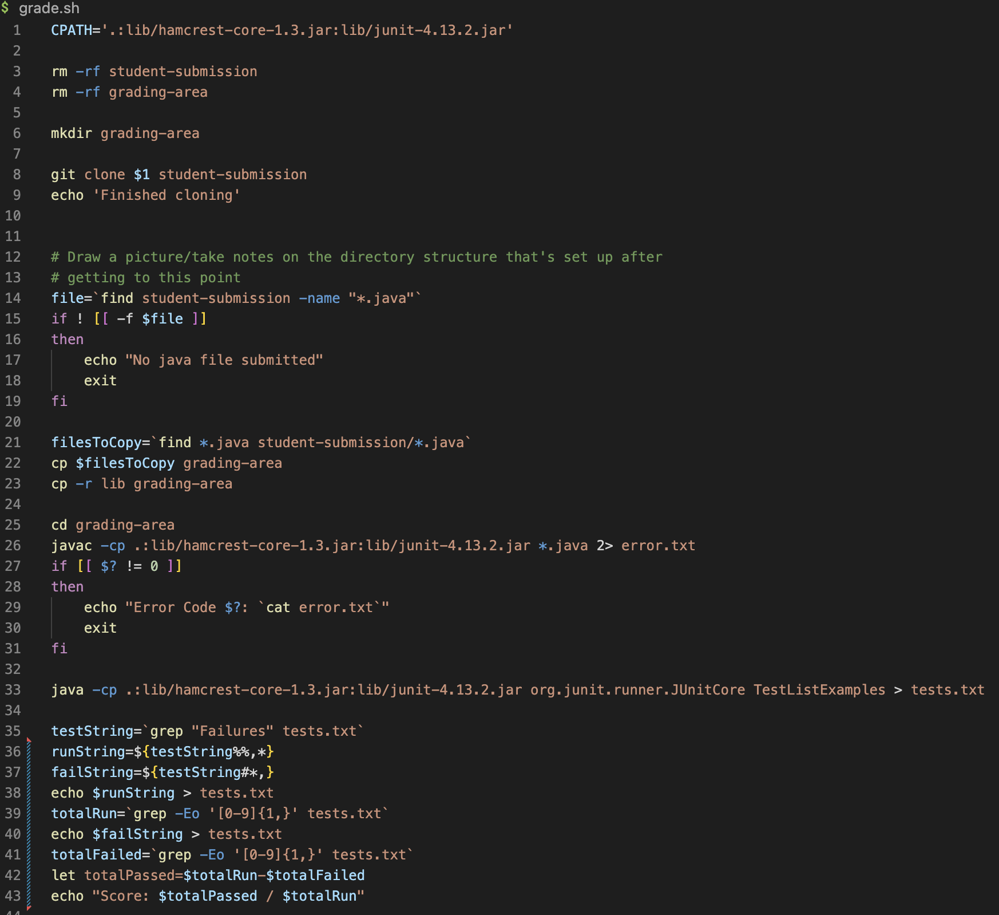

# Debugging Scenario

## Help: Unexpected blank output when running grade script
**Student**: Hello! I've run into an issue when running the corrected lab files using my bash script code. 

When running the script using https://github.com/ucsd-cse15l-f22/list-methods-lab3, it was able to correctly display a score, successfully retrieving the number of total tests and tests failed from the test results. 

I tried it with https://github.com/ucsd-cse15l-f22/list-methods-corrected but it doesn't output any numbers at all. 

In the terminal output, there was a syntax error reported for line 42, which I'm guessing is the source of the bug. I looked it over but have trouble finding what's wrong with the syntax. I also didn't get this error message when running the script with https://github.com/ucsd-cse15l-f22/list-methods-lab3 so I'm unsure about why there is a syntax error with this input. 

---

**TA**: Hi, I would look over the full test.txt file each time you run the script using different repositories. Look for any differences that may interfere with your code for retrieving the numbers from the test output. 

---

**Student**: Thank you for your help! I realized that the criteria I used to grep the appropriate line from the file doesn't work for when all test cases passed. I added an if statement to check for this case so it's able to retrieve the numbers in a different way from when 1+ test cases failed. In this case, there would be an OK statement rather than failure, so my initial grep statement didn't find a match when all test cases passed.  

It shows the score now! The syntax error is also gone. I think this happened in my initial code because the the variables totalRun and totalFailed had a null value when all test cases passed.

---

## All Information needed for setup
### File/Directory structure

### The contents of each file before fixing the bug
Only bash.sh is altered in this assignment.

### The full command line (or lines) ran to trigger the bug

### A description of what to edit to fix the bug
Line 35 caused the issue, since finding a match to "Failures" would not apply to test results in which all tests passed. Either the pattern to be matched can be changed so it matches the appropriate line no matter whether all test cases passed or 1+ failed, or the case in which all test passed can be considered seperately through if statements. 

One possible fix is...

This checks if testString is an empty string, which indicates that all tests have passed. In that case, it can grep the line with the OK message, use regex to retrieve the number from that line (which corresponds to the number of tests passed), and display the score, which is totalRun / totalRun since this case covers a full score. The "else" case is the same code as the initially written. 

## Reflection
One thing I learned from my lab experience in the second half of the quarter was using jUnit. I've only used built-in debuggers before, so debugging through the terminal was new to me. I also learned how to use Vim, which I only used a few times prior. Through the labs, I was able to use it more efficiently to move through a file and change its contents.